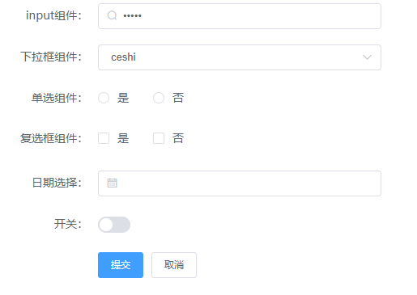
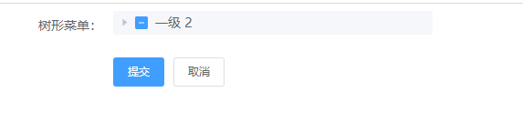

# el-ui-form

## Introduction
### NPM安装
```
npm install el-ui-form
```
### CDN使用
```
<script src="https://unpkg.com/el-ui-form"></script>
```

## 快速上手 
### 按需引入
```
import elUIForm form 'el-ui-form'
```
### 全局引入
在 main.js 中写入以下内容：(因为以element-ui的组件为基础，所以需要引入element-ui)
```
import Element from 'element-ui'
import 'element-ui/lib/theme-chalk/index.css'
import elUIForm form 'el-ui-form'
Vue.use(Element, {
  size: 'small' // set element-ui default size
})
Vue.use(elUIForm)
```

## 使用方法
### Template
```HTML
<el-ui-form :formItems="formItems" @submitForm="submitForm"></el-ui-form>
``` 
```JS
  data() {
    return {
      formItems: []
    }
  },
  methods: {
    submitForm(form){}
  }
``` 

## 属性

### 表单属性说明
属性 | 类型 | 说明 | 可选值 | 默认值
-------- | --- | --- | --- | ---
formItems | Object | 表单内容 | - | - 
width | String | 表单项宽度 | - | '350'
colon | String | 表单项lable文字后跟符号 | - | '：'
outerForm | Object | 表单值绑定对象 | - | null
includeFooter | String | 底部按钮的结构是否包含在表单内 | - | true
submit | Object | 默认表单按钮配置 | - | {type: ['primary', ''], text: ['提交', '取消']}
其他 | - | 主要属性查看element-ui 表单属性 https://element.eleme.cn/#/zh-CN/component/form | - | - 

### formItems属性说明
属性 | 类型 | 说明 | 可选值
-------- | --- | --- | ---
dom | String | 表单项要渲染的组件类型 | slot/element-ui 表单组件, slot对应的name为prop值
label | String | 表单项提示label | -
prop | String | 表单项值绑定的参数名称 | -
width | String/Number | 表单项组件宽度 | -
rules | Array | 单个表单项值绑定的校验规则 | -
attr | Object | 具体表单项对应的属性对象，具体属性参照dom的组件类型 | -
render | Function | dom为slot时有效, 自定义表单项内容(推荐表单项非表单组件时使用) | -

### formItems.attr属性说明
属性 | 类型 | 说明 | 可选值
-------- | --- | --- | ---
其他 | - | 主要属性查看element-ui 表单属性 https://element.eleme.cn/#/zh-CN/component/form | - | - 
code | Array | el-select/el-radio-group/el-checkbox-group的选项值数组 | -
opsKey | String | code数组对应选中值绑定的唯一键名 | -
opsValue | String | code数组对应显示的文本键名 | -

## 事件
### 表单事件
方法名 | 说明 | 回调参数
-------- | --- | ---
submitForm | 表单提交方法 | 表单model绑定参数值
其他 | 查看element-ui 表单属性 https://element.eleme.cn/#/zh-CN/component/form | - 


> 基于element-ui form二次封装, 组件主要属性请参见[element-ui文档说明](https://element.eleme.cn/#/zh-CN/component/form)


## 示例
### 基础表单组件
```HTML
<el-ui-form :formItems="formItems" label-width="150px" @submitForm="submitForm"></el-ui-form>
``` 
```JS
const list = [
  {name: '苹果', id: 1},
  {name: '草莓', id: 2},
  {name: '芒果', id: 3},
]
const data = [
  {value: '是', key: 1},
  {value: '否', key: 2},
]
export default{
  data() {
    return {
      formItems: [
        { dom: 'el-input', label: 'input组件', prop: 'ipt',  attr: { placeholder: '请输入input内容', type: 'password', 'prefix-icon': 'el-icon-search' }},
        { dom: 'el-select', label: '下拉框组件', prop: 'sel', attr: { placeholder: '请输入input内容', code: list, opsKey: 'id',  opsValue: 'name'}},
        { dom: 'el-radio-group', label: '单选组件', prop: 'radio', attr: { code: data}},
        { dom: 'el-checkbox-group', label: '复选框组件', prop: 'check', attr: { code: data}},
        { dom: 'el-switch', label: '开关', prop: 'switch' }
      ]
    }
  }
}
``` 
效果：


### dom:'slot'用法

- 通过HTML插入内容(slot name为prop的值)实现：
```HTML
<el-ui-form :formItems="formItems" label-width="150px" @submitForm="submitForm">
  <template #tree>
    <el-tree
      :data="data"
      show-checkbox
      node-key="id"
      :default-expanded-keys="[2, 3]"
      :default-checked-keys="[5]">
    </el-tree>
  </template>
</el-ui-form>
``` 
```JS
export default{
  data() {
    return {
      formItems: [
        { dom: 'slot', label: '树形菜单', prop: 'tree' },
      ],
      data: [{
        id: 1,
        label: '一级 2',
        children: [{
          id: 3,
          label: '二级 2-1',
          children: [{
            id: 4,
            label: '三级 3-1-1'
          }, {
            id: 5,
            label: '三级 3-1-2',
            disabled: true
          }]
        }, {
          id: 2,
          label: '二级 2-2',
          disabled: true,
          children: [{
            id: 6,
            label: '三级 3-2-1'
          }, {
            id: 7,
            label: '三级 3-2-2',
            disabled: true
          }]
        }]
      }],
      defaultProps: {
        children: 'children',
        label: 'label'
      }
    }
  }
}
``` 
- 表单项的render渲染：
```HTML
<el-ui-form :formItems="formItems" label-width="150px" @submitForm="submitForm"></el-ui-form>
``` 
```JS
export default{
  data() {
    return {
      formItems: [
        { dom: 'slot', label: '树形菜单', prop: 'tree', 
          render: ()=>{
          return (
              <el-tree
                data={this.data}
                show-checkbox
                node-key="id"
                default-expanded-keys={[2, 3]}
                default-checked-keys={[5]}>
              </el-tree>
            )
          } 
        }
      ],
      data: [{
        id: 1,
        label: '一级 2',
        children: [{
          id: 3,
          label: '二级 2-1',
          children: [{
            id: 4,
            label: '三级 3-1-1'
          }, {
            id: 5,
            label: '三级 3-1-2',
            disabled: true
          }]
        }, {
          id: 2,
          label: '二级 2-2',
          disabled: true,
          children: [{
            id: 6,
            label: '三级 3-2-1'
          }, {
            id: 7,
            label: '三级 3-2-2',
            disabled: true
          }]
        }]
      }],
      defaultProps: {
        children: 'children',
        label: 'label'
      }
    }
  }
}
```
> 如el-input的自定义slot内容也可以通过render渲染：
```JS
formItems: [
  { dom: 'el-input', label: 'input自定义项slot：prepend内容', prop: 'prepend',
    render: () =>{
      return (
        <el-select v-model={this.select} slot="prepend" placeholder="请选择">
          <el-option label="餐厅名" value="1"></el-option>
          <el-option label="订单号" value="2"></el-option>
          <el-option label="用户电话" value="3"></el-option>
        </el-select>
      )
    } 
  }
]
```
效果：

